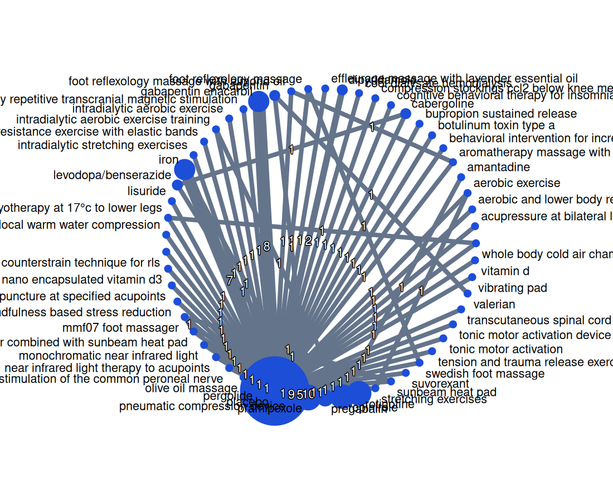
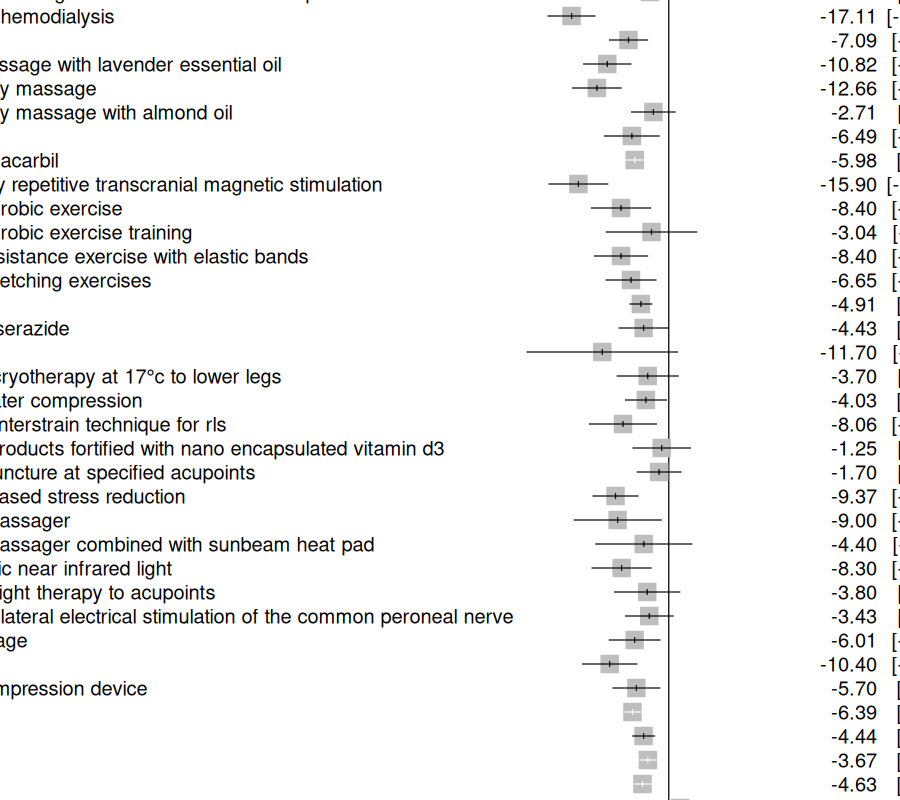

# Network meta-analysis — Restless Legs Syndrome (IRLS symptom severity)

> **Automated** network meta-analysis generated from this project's machine-extracted trial data. It reproduces the design of the published Zhou et al. 2021 RLS NMA (Front. Neurosci. 15:751643) as a validation target, but is **not** a substitute for a hand-curated review — see Caveats.

## Methods

- **Estimand:** mean difference in IRLS (0-40), lower = better vs **placebo** (negative = symptom improvement).
- **Model:** random-effects (DL), frequentist graph-theoretic NMA via **R netmeta 3.6.1**.
- **Inclusion:** randomized designs only (RCT / crossover / factorial / cluster); a single IRLS 0–40 scale (abbreviated 6-item, RLS-6, VAS and other scales excluded so the mean-difference network stays on one scale).
- **Treatment nodes:** canonical compound (formulations/brands merged; all control arms collapsed to a single placebo node). Analysis restricted to the placebo-anchored connected component.

## The network

- **96 studies**, **57 treatments**, 111 pairwise contrasts.
- Heterogeneity: τ = 1.676 (τ² = 2.809), I² = 59.1%.
- Inconsistency (node-splitting): 0 of 8 testable comparisons significant at p<0.05 (min p = 0.196). No material inconsistency detected.

## Treatment ranking — core drugs (≥2 trials)

Ranked over the **full** network (all interventions). P-score is the frequentist analogue of SUCRA (higher = better; 0–1). Single-trial nodes are listed separately below; the like-for-like comparison to Zhou et al. 2021 is in the next section.

| Treatment | Trials | MD vs placebo (95% CI) | P-score | Significant |
|---|---:|---|---:|:--:|
| cabergoline | 2 | -11.93 (-16.80, -7.06) | 0.88 | yes |
| dipyridamole | 2 | -7.09 (-10.45, -3.73) | 0.65 | yes |
| pramipexole | 12 | -6.39 (-7.77, -5.01) | 0.61 | yes |
| gabapentin | 2 | -6.49 (-11.31, -1.67) | 0.59 | yes |
| gabapentin enacarbil | 8 | -5.98 (-7.46, -4.51) | 0.57 | yes |
| iron | 8 | -4.91 (-6.85, -2.97) | 0.47 | yes |
| rotigotine | 11 | -4.63 (-6.05, -3.20) | 0.45 | yes |
| levodopa/benserazide | 2 | -4.43 (-8.75, -0.11) | 0.44 | yes |
| pregabalin | 5 | -4.44 (-6.37, -2.50) | 0.43 | yes |
| ropinirole | 11 | -3.67 (-5.09, -2.25) | 0.36 | yes |

## Validation vs Zhou et al. 2021 (pharmacological subset)

For a like-for-like comparison, the NMA was **re-run on only the 9 pharmacological drugs Zhou analysed**, so P-scores rank over the same node set as Zhou's SUCRA (the full 57-node landscape ranks placebo mid-pack and is not directly comparable).

- **Rank concordance** (Spearman, project P-score vs Zhou SUCRA): **0.6**.
- **Significance agreement:** **8 of 9** drugs agree on whether they beat placebo.
- **Coverage gap:** oxycodone-naloxone — analysed by Zhou but absent from this project's extracted network.

| Drug | Trials | Project MD (95% CI) | P-score | Zhou MD | SUCRA | ΔMD | Sig. agree |
|---|---:|---|---:|---:|---:|---:|:--:|
| cabergoline | 2 | -11.95 (-16.84, -7.05) | 0.99 | -12.05 | 98.7 | +0.10 | ✓ |
| pramipexole | 12 | -6.40 (-7.79, -5.01) | 0.75 | -5.44 | 57.2 | -0.96 | ✓ |
| gabapentin enacarbil | 8 | -5.99 (-7.47, -4.50) | 0.68 | -3.69 | 32.6 | -2.30 | ✓ |
| gabapentin | 1 | -6.50 (-11.35, -1.65) | 0.67 | -8.25 | 80.1 | +1.75 | ✓ |
| iron | 8 | -4.91 (-6.86, -2.96) | 0.47 | -5.65 | 51.0 | +0.74 | ✓ |
| rotigotine | 11 | -4.63 (-6.07, -3.20) | 0.41 | -5.12 | 54.7 | +0.49 | ✓ |
| levodopa/benserazide | 2 | -4.44 (-8.78, -0.10) | 0.41 | -4.33 | 41.5 | -0.11 | ✗ |
| pregabalin | 5 | -4.43 (-6.39, -2.48) | 0.38 | -5.34 | 56.4 | +0.91 | ✓ |
| ropinirole | 10 | -3.67 (-5.11, -2.24) | 0.24 | -2.50 | 16.8 | -1.17 | ✓ |

> Zhou MD/CI are primary-RLS estimates where available (all-studies for gabapentin and oxycodone-naloxone); SUCRA is Zhou's all-drug ranking. **Agreements:** cabergoline ranks first and ropinirole near-last in both; most MDs agree within ~1 IRLS point. **The one significance disagreement is levodopa** — the project CI barely excludes 0 while Zhou reports it not better than placebo. **Largest MD gap:** gabapentin enacarbil.

## Single-trial treatments (low evidence — interpret with caution)

These rank highly on P-score but rest on **one small trial each**; they are shown for completeness, not as recommendations.

| Treatment | MD vs placebo (95% CI) | P-score |
|---|---|---:|
| cool dialysate hemodialysis | -17.11 (-21.25, -12.97) | 0.98 |
| high frequency repetitive transcranial magnetic stimulation | -15.90 (-21.08, -10.72) | 0.97 |
| foot reflexology massage | -12.66 (-16.95, -8.37) | 0.91 |
| suvorexant | -12.70 (-17.29, -8.11) | 0.90 |
| effleurage massage with lavender essential oil | -10.82 (-14.99, -6.65) | 0.85 |
| pergolide | -10.40 (-15.18, -5.62) | 0.82 |
| mindfulness based stress reduction | -9.37 (-13.35, -5.39) | 0.78 |
| lisuride | -11.70 (-24.95, 1.55) | 0.78 |

## Forest plot (vs placebo)

## Caveats

- **Automated extraction.** Effect signs, SDs (often derived from SE/CI), arm drug identity, and timepoint selection were machine-extracted; NMA propagates such errors through indirect links. The Zhou cross-check + head-to-head spot-checks are the guardrail.
- **Heterogeneity** is high (I² = 59.1%): a broad 2004–present pull mixes severities, primary/secondary RLS, doses, and trial lengths — transitivity is weaker than the tightly-curated Zhou review.
- **Scale & basis.** One IRLS 0–40 scale only; endpoint scores preferred over change-from-baseline where both exist; crossover trials handled approximately; non-randomized designs excluded.
- **Sparse nodes.** Most compounds have a single trial; the credible signal is the ≥2-trial core above. Single-trial nodes can top the ranking on thin evidence.
